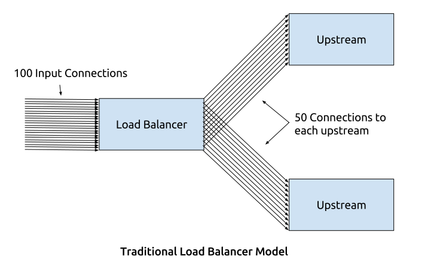
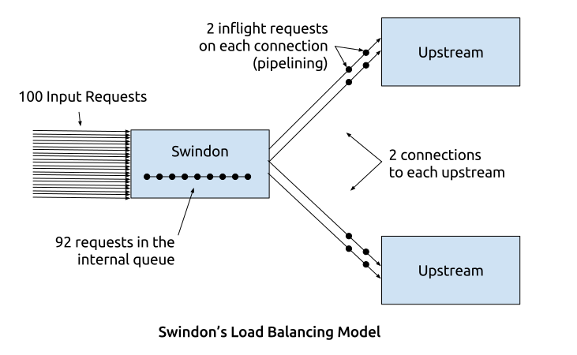

Load Balancing
==============

This is an informal description of how swindon does load balancing. Note
currently there is only one strategy described here. We have few improved
strategies on the roadmap.

To make it easier to reason about, let's start from describing traditional
load balancers (this is **not** how swindon works):

This is how TCP level load-balancers work, and also how HAProxy and Nginx
work to the best of my knowledge. (Nginx can offload keep-alive connections
on itself, but if we change "100 Active Connections" to "100 Active Requests",
chart is he same for nginx goo).

Here is how swindon works:

More specifically:

1. Opens at max N connections to each backend
   (:opt:`backend-coonnections-per-ip-port`)
2. Queues requests internally
3. Sends queued requests to first server become idle

.. note:: The picture describes a concept but the default settings are
   different.  Default connection limit is 100 and we don't enable pipelining
   by default (because it's unsafe to pipeline POST requests or long-polling).

Demo
----

Here is a demo of swindon's load balancing compared with other common
techniques:

.. raw:: html

   <iframe src="simulations/index.html" frameborder="0"
    width="800" height="700"></iframe>
   

     <a href="simulations/index.html" target="_newtab">Open in New Tab</a>
   

.. admonition:: Credits

   The demo is adapted from `a wonderful talk`__ by `Steve Gury`__. The plan
   is to eventually incorporate the technique from his talk.

   __ https://storage.googleapis.com/strangeloop2017/index.html
   __ https://twitter.com/stevegury
